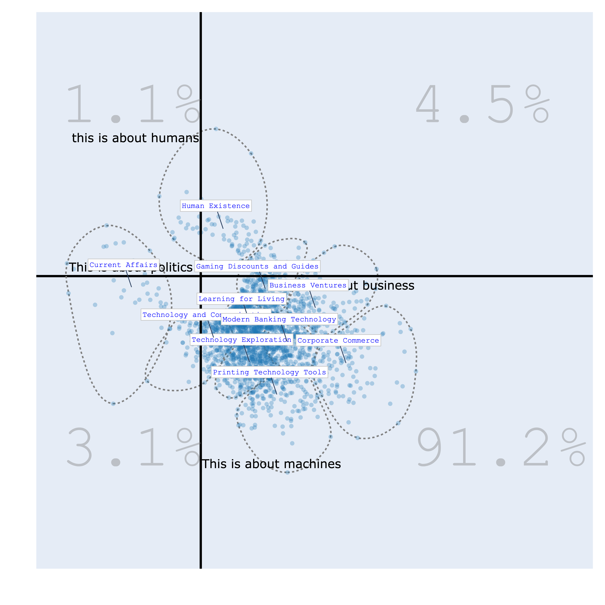
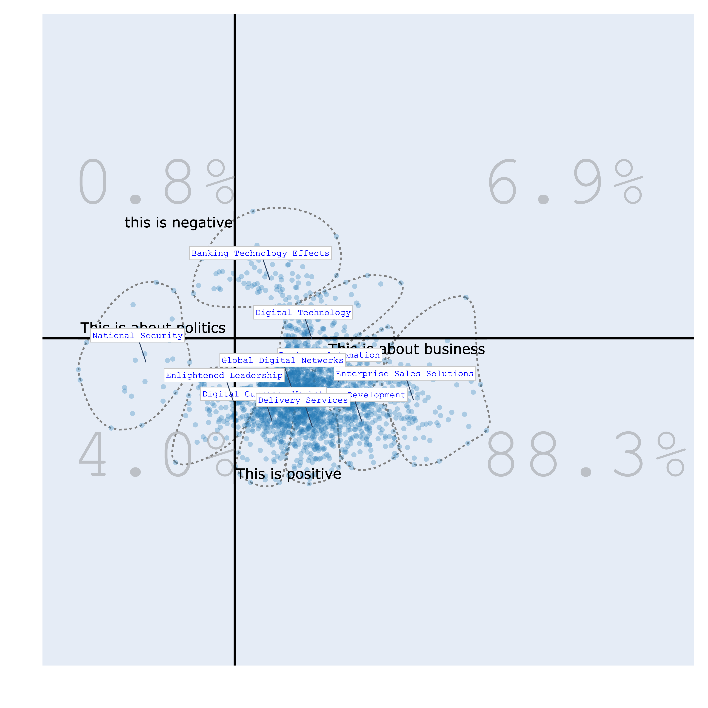
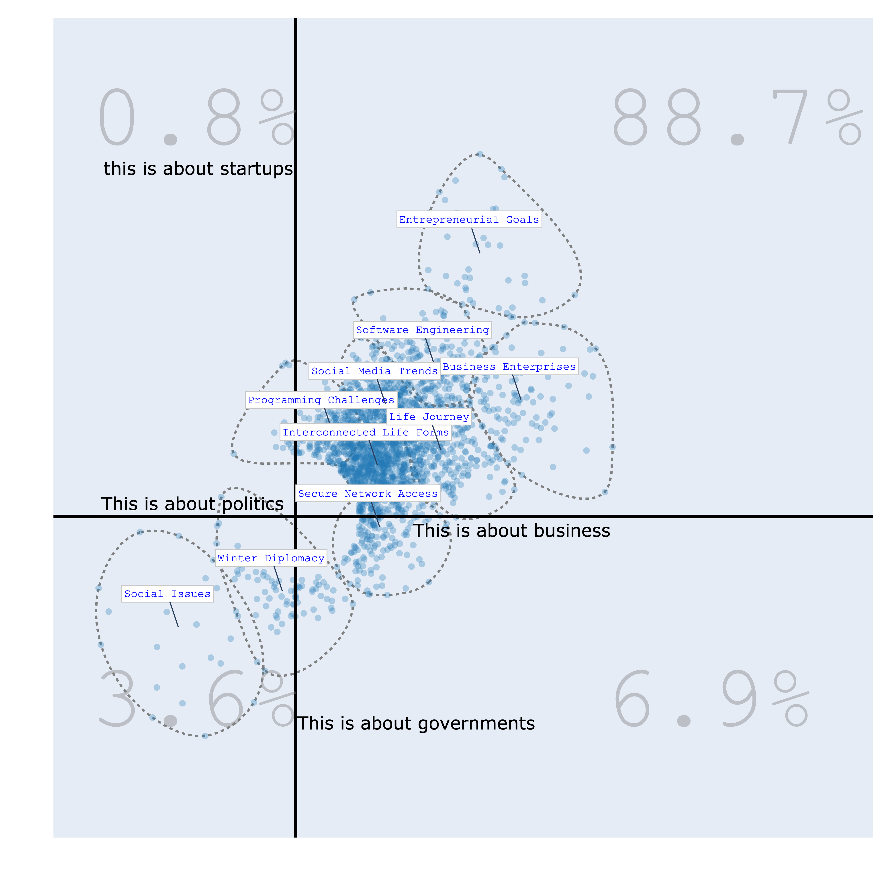

# Framing Analysis

Data can be analyzed in countless ways, contingent on your objectives and interests. We've developed a tool that enables you to visualize data by semantically customizing your own axes.

## Discover different examples using our Google Colab Notebooks

| Theme  | Google Colab Link  |
|---|---|
| Understanding a dataset using Frame Analysis with Bunka | [](https://colab.research.google.com/drive/1YnOEg9YqsFQLm5OzIpJWBDSsXSNG4zBq#scrollTo=I7P3ZZNb9jO8)

## Installation via Pip

```bash
pip install bunkatopics
```

## Installation via Git Clone

```bash
git clone https://github.com/charlesdedampierre/BunkaTopics.git
cd BunkaTopics
pip install -e .
```

## Quick Start

### Uploading Sample Data

To get started, let's upload a sample of Medium Articles into Bunkatopics:

```python
from datasets import load_dataset
docs = load_dataset("bunkalab/medium-sample-technology")["train"]["title"] # 'docs' is a list of text [text1, text2, ..., textN]
```

### Choose Your Embedding Model and fit the model

Bunkatopics offers seamless integration with Huggingface's extensive collection of embedding models. You can select from a wide range of models, but be mindful of their size. Please refer to the langchain documentation for details on available models.

```python
from bunkatopics import Bunka
from langchain_community.embeddings import HuggingFaceEmbeddings

# Choose your embedding model
embedding_model = HuggingFaceEmbeddings(model_name="all-MiniLM-L6-v2") # We recommend starting with a small model

# Initialize Bunka with your chosen model and language preference
bunka = Bunka(embedding_model=embedding_model, language='english') # You can choose any language you prefer

# Fit Bunka to your text data
bunka.fit(docs)
```

## Bourdieu Map

The Bourdieu map provides a 2-Dimensional unsupervised scale to visualize various texts. Each region on the map represents a distinct topic, characterized by its most specific terms. Clusters are formed, and their names are succinctly summarized using Generative AI.

The significance of this visualization lies in its ability to define axes, thereby creating continuums that reveal data distribution patterns. This concept draws inspiration from the work of the renowned French sociologist Bourdieu, who employed 2-Dimensional maps to project items and gain insights.

```python
from langchain.llms import HuggingFaceHub

# Define the HuggingFaceHub instance with the repository ID and API token
llm = HuggingFaceHub(
    repo_id='mistralai/Mistral-7B-v0.1',
    huggingfacehub_api_token="HF_TOKEN"
)

## Bourdieu Fig
bourdieu_fig = bunka.visualize_bourdieu(
        llm=llm, # Set to None if you don't need  GenAI summarization
        x_left_words=["This is about business"],
        x_right_words=["This is about politics"],
        y_top_words=["this is about startups"],
        y_bottom_words=["This is about governments"],
        height=800,
        width=800,
        clustering=True,
        topic_n_clusters=10,
        density=False,
        convex_hull=True,
        radius_size=0.2,
        label_size_ratio_clusters=80)

# Display the Bourdieu map
bourdieu_fig.show()
```

positive/negative vs humans/machines            |  politics/business vs humans/machines  
:-------------------------:|:-------------------------:
  |  

politics/business vs     positive/negative      |  politics/business vs startups/governments
:-------------------------:|:-------------------------:
  |  
